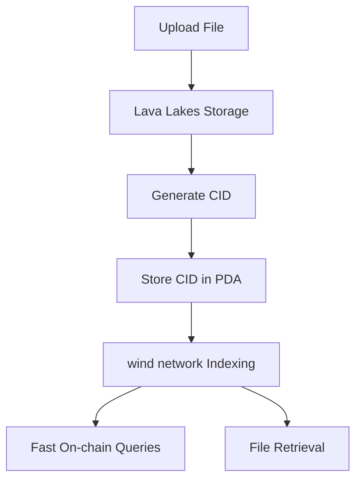

# cPDA (Compressed Program Derived Accounts)

## Overview

**cPDA** represents a innovative approach to blockchain data storage that bridges the gap between cost-effective compressed NFTs and fully queryable Program Derived Accounts. cPDA enables developers to store large files off-chain while maintaining fast, on-chain queryability of their Content Identifiers (CIDs).

## What is cPDA?

cPDA (Compressed Program Derived Accounts) is a hybrid storage solution that combines:

- **Off-chain file storage** on wind network's Lava Lakes (Filecoin & Akave)
- **On-chain CID indexing** through optimized PDAs
- **Sub-100ms query performance** via wind network's distributed indexer
- **Cost efficiency** that's 5x more than cNFTs but significantly cheaper than traditional PDAs

## How cPDA Works



### 1. File Upload to Lava Lakes
Files of any size are uploaded to wind network's distributed storage layer called "Lava Lakes," which provides:
- **Unlimited file sizes** - from small documents to large media files
- **Content addressing** - each file gets a unique CID
- **Distributed storage** - files are replicated across multiple nodes
- **High availability** - redundant storage ensures data persistence

### 2. On-chain CID Storage
The generated CID is stored in a compressed PDA structure:
```rust
pub struct CompressedCidPDA {
    pub cid_hash: [u8; 32],           // SHA256 of full CID
    pub file_size: u32,               // File size in bytes
    pub upload_timestamp: u32,        // Unix timestamp
    pub file_type: u8,                // File type enum
    pub access_permissions: u8,       // Permission flags
    pub retrieval_nodes: [u8; 4],     // Node addresses for retrieval
}
```

### 3. wind network Indexing
The wind network indexer processes the PDA data to enable:
- **Real-time indexing** of new CIDs
- **Fast query resolution** with sub-100ms response times
- **Cross-references** between CIDs and file metadata
- **Automatic failover** for file retrieval

## Performance Comparison

| Feature | cNFT | cPDA | Traditional PDA | NFT |
|---------|------|------|-----------------|-----|
| **Cost** | Lowest | 5x cNFT | 20-100x cNFT | 10x cNFT |
| **Query Speed** | 400-2400ms | **<100ms** | 100-500ms | 100-500ms |
| **File Size Support** | Limited | **Unlimited** | Limited | Limited |
| **On-chain Queryability** | No | **Yes** | Yes | Yes |
| **Decentralization** | High | **High** | Medium | Low |

## Key Benefits

### 🚀 **Ultra-Fast Queries**
- Sub-100ms on-chain CID queries
- 10-24x faster than cNFT indexing solutions
- Real-time data availability

### 💰 **Cost Efficiency**
- 95% cheaper than traditional PDA storage for large files
- Only 5x more expensive than cNFTs
- Linear cost scaling regardless of file size

### 📁 **Unlimited File Sizes**
- Support for files from bytes to terabytes
- No blockchain transaction size limitations
- Efficient storage on Lava Lakes

### 🔍 **Full On-chain Queryability**
- Direct smart contract integration
- Complex query support
- No external indexer dependencies

### 🌐 **Decentralized Architecture**
- Distributed across wind network nodes
- No single points of failure
- Community-operated infrastructure

## Use Cases

### 1. **Large File Management Systems**
Perfect for applications requiring both large file storage and fast metadata queries:
```typescript
// Store a large video file with instant metadata access
const result = await windClient.uploadToCPDA({
  file: largeVideoFile,
  metadata: {
    title: "Conference Recording",
    duration: 3600,
    quality: "4K"
  }
});

// Query metadata in <100ms
const metadata = await windClient.queryCID(result.cid);
```

### 2. **Decentralized Content Distribution**
Enable fast content discovery with efficient file retrieval:
```typescript
// Upload content to cPDA
const contentCID = await windClient.uploadContent(podcast);

// Users can instantly query if content exists
const exists = await contract.verifyCID(contentCID); // <100ms

// Retrieve full content when needed
const content = await windClient.retrieveFile(contentCID);
```

### 3. **Legal Document Storage**
Combine regulatory compliance with performance:
```typescript
// Store legal documents with timestamp verification
const docResult = await windClient.uploadLegalDoc({
  document: contractPDF,
  attestation: digitalSignature,
  compliance: "SOX"
});

// Fast compliance checks
const isCompliant = await contract.checkCompliance(docResult.cid);
```

### 4. **Academic Research Data**
Handle large datasets with instant metadata access:
```typescript
// Store research dataset
const datasetCID = await windClient.uploadDataset({
  data: largeBiologyDataset,
  metadata: {
    study: "Protein Analysis 2024",
    size: "50GB",
    format: "HDF5"
  }
});

// Researchers can quickly verify dataset existence
const verified = await contract.verifyDataset(datasetCID);
```

## API Reference

### Upload to cPDA

```typescript
interface CPDAUploadOptions {
  file: File | Buffer;
  metadata?: Record<string, any>;
  permissions?: AccessPermissions;
  redundancy?: number; // Number of storage replicas
}

interface CPDAUploadResult {
  cid: string;
  pda: PublicKey;
  fileSize: number;
  uploadTimestamp: number;
  retrievalNodes: string[];
}

const result = await windClient.uploadToCPDA(options);
```

### Query CID On-chain

```typescript
interface CIDQueryOptions {
  cid: string;
  includeMetadata?: boolean;
  verifyIntegrity?: boolean;
}

interface CIDQueryResult {
  exists: boolean;
  fileSize: number;
  uploadTimestamp: number;
  fileType: string;
  permissions: AccessPermissions;
  retrievalNodes: string[];
  metadata?: Record<string, any>;
}

const result = await windClient.queryCID(cid, options);
```

### Retrieve File

```typescript
interface RetrievalOptions {
  cid: string;
  preferredNode?: string;
  timeout?: number;
  verifyIntegrity?: boolean;
}

const file = await windClient.retrieveFile(options);
```

## Smart Contract Integration

### Solana Program Integration

```rust
use wind_network_sdk::cPDA;

#[program]
pub mod my_program {
    pub fn verify_document(
        ctx: Context<VerifyDocument>,
        cid: String,
    ) -> Result<()> {
        // Query cPDA in <100ms
        let cid_info = cPDA::query_cid(&cid)?;
        
        require!(cid_info.exists, ErrorCode::DocumentNotFound);
        require!(cid_info.file_size > 0, ErrorCode::InvalidDocument);
        
        // Use the verified CID in your program logic
        ctx.accounts.document_registry.add_verified_document(cid)?;
        
        Ok(())
    }
}
```

### TypeScript Client Integration

```typescript
import { WindClient, cPDA } from '@wind-network/sdk';

class DocumentManager {
  private windClient: WindClient;
  
  constructor() {
    this.windClient = new WindClient({
      endpoint: 'https://api.windnetwork.ai',
      cluster: 'mainnet-beta'
    });
  }
  
  async uploadDocument(file: File, metadata: any) {
    // Upload to cPDA
    const result = await this.windClient.uploadToCPDA({
      file,
      metadata,
      redundancy: 3 // Store on 3 nodes
    });
    
    // Store CID reference on-chain
    await this.storeOnChain(result.cid, result.pda);
    
    return result;
  }
  
  async verifyDocument(cid: string) {
    // Fast on-chain verification (<100ms)
    const exists = await this.windClient.queryCID(cid);
    return exists.exists && exists.fileSize > 0;
  }
  
  async retrieveDocument(cid: string) {
    // Retrieve full file from Lava Lakes
    return await this.windClient.retrieveFile({ cid });
  }
}
```

## Cost Breakdown

### Storage Costs (per 1GB file)

| Solution | Upload Cost | Storage Cost/Month | Query Cost | Total (1 year) |
|----------|-------------|-------------------|------------|-------------|
| cNFT | $0.001 | N/A | $0.01/query | $0.001 + queries |
| **cPDA** | **$0.005** | **$0.10** | **$0.0001/query** | **$1.205** |
| Traditional PDA | $50.00 | $20.00 | $0.001/query | $290.00 |
| Centralized Storage | $0.00 | $0.50 | $0.10/query | $6.00 + queries |

*Note: Costs are estimates and may vary based on network conditions*

## Getting Started

### 1. Install the SDK

```bash
npm install @wind-network/sdk
# or
yarn add @wind-network/sdk
```

### 2. Initialize the Client

```typescript
import { WindClient } from '@wind-network/sdk';

const client = new WindClient({
  endpoint: 'http://test-may-us-01.windnetwork.ai:3000/api',
  cluster: 'devnet' // or 'mainnet-beta'
});
```

### 3. Upload Your First File

```typescript
async function uploadExample() {
  // Upload a file to cPDA
  const file = new File(['Hello, cPDA!'], 'example.txt');
  
  const result = await client.uploadToCPDA({
    file,
    metadata: {
      description: 'My first cPDA upload',
      category: 'example'
    }
  });
  
  console.log('File uploaded with CID:', result.cid);
  console.log('PDA address:', result.pda.toString());
  
  // Query the CID (should be <100ms)
  const queryResult = await client.queryCID(result.cid);
  console.log('Query result:', queryResult);
  
  return result;
}
```

## Best Practices

### 1. **Optimize for Query Patterns**
```typescript
// Good: Store frequently queried metadata on-chain
const result = await client.uploadToCPDA({
  file: document,
  metadata: {
    title: doc.title,        // Frequently searched
    category: doc.category,  // Used for filtering
    timestamp: Date.now()    // Used for sorting
  }
});

// Query pattern
const docs = await client.queryMultipleCIDs({
  filter: { category: 'legal' },
  sortBy: 'timestamp',
  limit: 100
});
```

### 2. **Implement Proper Error Handling**
```typescript
try {
  const result = await client.uploadToCPDA(options);
} catch (error) {
  if (error.code === 'STORAGE_FULL') {
    // Retry with different nodes
    await client.uploadToCPDA({
      ...options,
      preferredNodes: alternativeNodes
    });
  } else if (error.code === 'NETWORK_TIMEOUT') {
    // Implement exponential backoff
    await retryWithBackoff(() => client.uploadToCPDA(options));
  }
}
```

### 3. **Leverage Caching**
```typescript
class CPDACache {
  private cache = new Map();
  
  async getCIDInfo(cid: string) {
    if (this.cache.has(cid)) {
      return this.cache.get(cid);
    }
    
    const info = await client.queryCID(cid);
    this.cache.set(cid, info);
    return info;
  }
}
```

## Monitoring and Analytics

### Performance Metrics
Track key performance indicators for your cPDA implementation:

```typescript
const metrics = await client.getCPDAMetrics({
  timeRange: '24h',
  metrics: [
    'query_latency',
    'upload_success_rate',
    'retrieval_speed',
    'storage_utilization'
  ]
});

console.log('Average query latency:', metrics.query_latency.avg); // Should be <100ms
console.log('Upload success rate:', metrics.upload_success_rate); // Should be >99%
```

### Health Monitoring
```typescript
const health = await client.getSystemHealth();
console.log('Network status:', health.status);
console.log('Available storage:', health.storage.available);
console.log('Active nodes:', health.nodes.active);
```

## Support and Community

- **Documentation**: [windnetwork.ai/docs](https://windnetwork.ai/docs)
- **GitHub**: [github.com/wind-network](https://github.com/wind-network)
- **Telegram - Early Users**: [@wind_network](https://t.me/wind_network)
- **Email**: vivek@windnetwork.ai

## FAQ

**Q: How does cPDA compare to traditional IPFS + blockchain solutions?**
A: cPDA offers significantly faster on-chain queries (<100ms vs 400-2400ms) while maintaining cost efficiency and decentralization. Traditional IPFS solutions require external indexers, while cPDA queries work directly on-chain.

**Q: What happens if Lava Lakes nodes go offline?**
A: Files are replicated across multiple nodes with automatic failover. The system maintains 99.9% uptime through redundant storage and dynamic node replacement.

**Q: Can I migrate existing data to cPDA?**
A: Yes, we provide migration tools for common storage solutions including IPFS, AWS S3 compatablity, and traditional blockchain storage.

**Q: Is cPDA suitable for high-frequency trading applications?**
A: Absolutely. The sub-100ms query performance makes cPDA ideal for applications requiring real-time data verification with cost efficiency.

**Q: How does pricing work for large enterprises?**
A: We offer volume discounts and custom pricing for enterprise deployments. Contact us for detailed pricing based on your usage patterns.